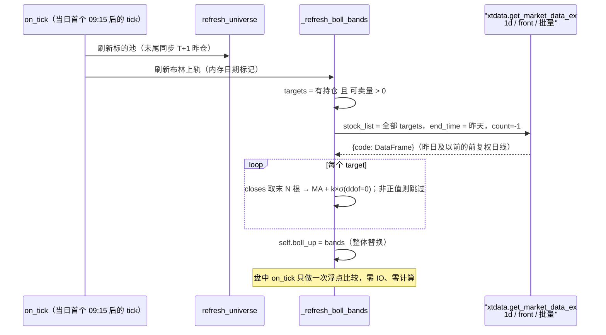

# 卖出信号新增：日线布林上轨止盈（设计）

> 适用策略：`strategies/near_ma_surge_strategy.py`（信号框架：`signals/`）
> 状态：**已实现**（2026-09-29，验证结果见 §9）

## 0. 变更记录

| 日期 | 版本 | 变更 |
| --- | --- | --- |
| 2026-09-29 | v0.1 | 初稿：目标 / 决策定案 / 布林计算方式 / 数据加载方式 / 触发规则 / 边界 / 落点 |
| 2026-09-29 | v0.2 | 精简：只保留「当日布林上轨」一个值，删除中轨/下轨、备选方案与对比表 |
| 2026-09-29 | v0.3 | 取数范围收窄：**只算“当天可卖出的持仓”**（不再按当日池全量）；时机改为 `on_tick` 日切 + 内存标记，与标的池刷新解耦（§5.1） |
| 2026-09-29 | v0.4 | 复权口径改为**前复权**：因此不能再用 `engine.load_bar`（其 `XtDatafeed` 把 `dividend_type` 写死为 `none`），改为直连 `xtdata.get_market_data_ex` 批量取数（§5.2–§5.3） |
| 2026-09-29 | v1.0 | **已实现**（改动清单与验证结果见 §9） |
| 2026-09-29 | v1.1 | 盈利门槛从 `> 0` 提到 **`>= BOLL_MIN_PROFIT_PCT`（默认 5%）**：收益不足不卖，生效区间变为 5% ≤ 收益 < 10% |

## 1. 背景与目标

当前卖出全部建立在**固定百分比点位**上（`signals/sell_signals.py`）：

| 环节 | 条件 | 性质 |
| --- | --- | --- |
| 止损（常规档） | 相对开仓价 ≤ −2% | 固定点 |
| 止损（开盘宽档） | 10:00 前相对开仓价 ≤ −4% | 固定点 |
| 清仓止盈 | 收益 ≥ `clear_profit_pct`(20%) | 固定点 |
| 减半止盈 | 收益 ≥ `half_profit_pct`(10%) | 固定点 |
| 回撤止盈 | `max_profit − 当前 ≥ 10%` | 固定点 |
| 保底收益线 | 曾涨 ≥10%/5%/3% → 保 5%/2%/0% | 固定点 |
| 情绪离场 | 收益 < 3% 且行业评级已转弱 | 情绪（非价格） |

固定点的问题是**与个股自身波动无关**：波动大的票 2% 是噪声，波动小的票 2% 已是极限。布林上轨（`MA + k×σ`）是**按该标的自身波动尺度**给出的动态目标位，用来做"小赚就落袋"的兜底更合理。

**目标**：新增一个卖出子信号——**价格触及日线布林上轨且当前盈利时全清**，作为 10%/20% 止盈档之后的兜底止盈。

**非目标**：不做盘中分钟级布林、不做中轨/下轨用法、不做回测接入（原因见 §8.3）。**只算上轨这一个值**。

## 2. 决策定案

| # | 决策项 | 定案 | 理由 / 代价 |
| --- | --- | --- | --- |
| 1 | 布林周期基准 | **日线**（每日盘前刷新一次） | 最省：无 tick 合成、无 per-tick 计算；代价是上轨一天内不变，日内不敏感 |
| 2 | 触发语义 | **触及即卖**：`last_price >= boll_up`（不做"上穿"判定、不留触发标记） | 实现最简单；重复触发由 T+1 卖出冻结量天然抑制（见 §6.3） |
| 3 | 卖出量 | **全清**（`SignalType.CLEAR`，`volume = get_sellable(vt_symbol)`） | 与"止盈"定位一致；不留尾仓，避免与减半档语义打架 |
| 4 | 链内优先级 | 排在 `PriceSellSubSignal` **之后**（即止损/20%/10%/回撤/保底全部优先） | 定位是"兜底"：只在 5% ≤ 收益 < 10% 且摸到上轨时生效 |
| 5 | 盈利门槛 | 收益必须 `>= BOLL_MIN_PROFIT_PCT`（默认 **5%**） | 两个作用：一是防"下跌后的反弹假突破上轨"在亏损位置清仓，二是避免只赚一两个点就提前离场（与 `half_profit_pct` 10% 之间形成 5%~10% 的落袋窗口） |
| 6 | 取数范围 | **只算“当天可卖出的持仓”**：`pos > 0 且 get_sellable(vt) > 0` | 不能卖的标的算上轨没有意义（今仓 T+1 不可卖、无持仓的池内标的走不到卖出分支）；RPC 次数从“池子几百只”降到“持仓只数”（见 §5.1） |
| 7 | 复权方式 | **前复权**（`dividend_type="front"`） | 前复权序列的最后一根 = 最新真实价（历史价按除权因子折算到最新口径），与盘中 `tick.last_price` 同尺度；不复权的话，窗口内有除权的票 band 会高高飘在实盘价上方（永远碰不到）。代价：**取数必须绕开引擎**（见 §5.2） |

### 2.1 由此推出的生效区间

因为优先级在 `PriceSellSubSignal` 之后，本信号实际只在下列条件**同时**满足时生效：

```
未触发止损、未达 clear_profit_pct(20%)、未达 half_profit_pct(10%)、
未触发回撤止盈、未跌破保底线
且 收益 >= BOLL_MIN_PROFIT_PCT(5%)
且 现价 >= 日线布林上轨
→ 全清
```

若后续想让"摸到上轨就先走"（比 10% 更早落袋），只需把 `BollUpperSellSubSignal` 移到 `SellSubSignal.sub_factories` 中 `PriceSellSubSignal` 之前——**这是一个排列组合问题，不需要改信号内部逻辑**（这正是现有优先级短路链的价值）。

## 3. 卖出链落点

卖出链现状：`SellAggregator` → `SellSubSignal`（优先级短路）→ `SectorSellSubSignal`（情绪离场）→ `PriceSellSubSignal`（止损/清仓/减半/回撤/保底）。

改后：在 `SellSubSignal.sub_factories` **末尾追加** `BollUpperSellSubSignal`，其余节点不动。


策略侧 `on_tick` **不改**：新信号产出 `CLEAR` 后自动走既有下单、卖出委托监控（`OrderMonitor`）、日志/企微通路（`SignalResult.reason` 进日志）。

## 4. 布林线的计算方式（重点）

### 4.1 定义

对某标的的**日线收盘价**序列取最近 `N` 根（`N = boll_window`，默认 20）：

$$
MA = \frac{1}{N}\sum_{i=1}^{N} C_i
\qquad
\sigma = \sqrt{\frac{1}{N}\sum_{i=1}^{N}\left(C_i - MA\right)^2}
$$

$$
up = MA + k \cdot \sigma
$$

`k = boll_dev`（默认 `2.0`）。**只算 `up` 这一个值**，中轨/下轨不算、不存、不用。

### 4.2 标准差口径（已核对源码）

本仓库其它策略的 `ArrayManager.boll(n, dev)`（`d:\kproject\QT\vnpy\vnpy\trader\utility.py`）= `talib.SMA(close, n)` ± `dev × talib.STDDEV(close, n, 1)`：

- `talib.STDDEV(nbdev=1)` 是**总体标准差（除以 N，`ddof=0`）**；
- ⚠️ 必须用 `np.std(closes, ddof=0)`，**不要**用 pandas 默认的 `.std()`（`ddof=1`），否则同一根上轨在不同策略里数值不同。

实现（不构造 `ArrayManager`，省掉每标的 100 根数组；`closes` 来自 §5.2 的 xtdata 前复权日线）：

```python
closes = np.asarray(df["close"].to_numpy(), dtype=float)[-n:]
if len(closes) < n or not np.isfinite(closes).all() or (closes <= 0).any():
    return 0.0                       # 样本不足 / 全 0 或非正价（前复权未落地）→ 不可用
up = float(closes.mean()) + dev * float(closes.std(ddof=0))
```

### 4.3 输入数据口径

| 项 | 取值 | 说明 |
| --- | --- | --- |
| 价格字段 | `BarData.close_price` | 只用收盘价，不用 high/low |
| 复权方式 | **前复权** | `dividend_type="front"`。前复权序列的**最后一根收盘价 = 最新真实价**，所以 band 与盘中实盘价同尺度；窗口内有除权的票也不会出现“上轨高高飘着、永远碰不到”。注意：前复权序列会随新除权事件**整体重算**，所以 band 绝不能落盘（§4.4） |
| 是否含当日 | **不含当日** | 盘前（09:15）取数，数据服务本身也会过滤 15:00 前的当日未完成日线（§5.3） |
| 最少根数 | `>= boll_window` | 不足则 `boll_up = 0`，该标的此信号不生效（其余卖出档不受影响） |
| 缺失处理 | 不填充 | 数据服务 `fill_data=False`：停牌日无 bar，序列是"有成交的交易日"序列 |

### 4.4 参数与默认值

| 参数 | 默认 | 说明 |
| --- | --- | --- |
| `boll_window` | `20` | 日线周期数，进 `parameters`（可回测/优化） |
| `boll_dev` | `2.0` | 标准差倍数，进 `parameters` |
| `BOLL_LOOKBACK_DAYS` | `60` | 取数回溯的**自然日**（常量，不进 `parameters`）。20 个交易日 ≈ 28 自然日，再加节假日/停牌冗余 → 取 60（≈40 交易日）。多取不增加成本（仍是同一次批量 RPC），只影响“能取到几根日线” |
| `BOLL_MIN_PROFIT_PCT` | `0.05` | 收益门槛：不足此值不按上轨卖（含亏损）。要调可改常量，或后续需要回测/优化时再挪进 `parameters` |
| `BOLL_DIVIDEND_TYPE` | `"front"` | 复权方式：前复权。可切 `"front_ratio"`（等比前复权，低价股更稳健）；两者的取值都由大 QMT 支持 |

`boll_up` 是**运行时派生量**：放内存字典即可，不进 `variables`（不落盘），重启后盘前重算。前复权序列还会随新除权事件整体重算，落盘的历史值第二天就可能失真——更不该存。

## 5. 数据加载方式（重点）

### 5.1 取数范围与时机

**范围：只算“当天可卖出的持仓”（决策 6）**

```python
targets = [
    vt_symbol for vt_symbol, pos in self.pos_data.items()
    if pos > 0 and self.get_sellable(vt_symbol) > 0
]
```

- 当日买入的（今仓）T+1 不可卖 → 不算（`get_sellable` = 昨仓 − 卖出冻结，见 `template.py`）；
- 当日池里**没有持仓**的标的 → 不算（仓位为 0，根本走不到卖出分支）；
- 已清仓/退订的 → 不算，且每次刷新**整体替换** `boll_up`，天然清掉旧条目。

**时机：每天 09:15（日切）刷一次，用内存日期标记**（不落盘）

```python
tick_time = tick.datetime.time()
if tick_date != self.last_refresh_date and tick_time >= self.REFRESH_TIME:
    self.refresh_universe()          # 末尾已做 T+1 持仓同步
if tick_date != self.boll_date and tick_time >= self.REFRESH_TIME:
    self.boll_date = tick_date
    self._refresh_boll_bands()       # 目标 = 当天可卖出的持仓
```

三个关键点：

1. **必须夹在 T+1 持仓同步之后**：`refresh_universe()` 正常路径末尾会调 `self.strategy_engine.init_t1_position(self)`。昨仓口径每天变（昨天买入的今天才可卖），不先同步就可能拿到昨天甚至前天的旧值，把应该算的标的排掉。（盘中重启的场景由启动时 `_init_strategy` 末尾的那次 `init_t1_position` 兜底。）
2. **用内存标记 `self.boll_date`，不用持久化变量**：盘中重启时（当日池子已刷新过、`last_refresh_date` 已是今天 → 不会重跑 `refresh_universe`）也能补算一次，不会整天没有上轨。
3. **与标的池的 5 条出口完全解耦**：上轨只依赖“可卖持仓 + 昨日日线”，池子刷新成功与否都不影响它；不需要在 `refresh_universe` 里到处插调用。

### 5.2 取数接口：直连 `xtdata`（因为要前复权）

**不能用 `engine.load_bar`**：它最终走 `XtDatafeed.query_bar_history`，而那里 `dividend_type` 写死为 `"none"`（`vnpy_xt/vnpy_xt/xt_datafeed.py`）。三条路都拿不到前复权：

| 路 | 为何不行 |
| --- | --- |
| `engine.load_bar` → 网关 `query_history` | `XtGateway` 的合约 `history_data=False`（已核对），引擎根本不走这条路，且 `XtGateway.query_history` 返回 `None`（异步下载语义） |
| `engine.load_bar` → 数据服务 `XtDatafeed` | `dividend_type="none"` 写死（已核对源码） |
| `engine.load_bar` → 数据库 `load_bar_data` | 库里录的是实盘原始价（不复权），同样不合口径 |

所以**直连 `xtdata`**（策略里已有一处先例：`_previous_trade_date` 就用 `xtdata.get_trading_dates` 取交易日历）：

```python
import numpy as np
from bigqmt_signal_trader.xtquant_compat import xtdata

end: str = (date.today() - timedelta(days=1)).strftime("%Y%m%d")   # 排除当日
start: str = (date.today() - timedelta(days=self.BOLL_LOOKBACK_DAYS)).strftime("%Y%m%d")
data: dict = xtdata.get_market_data_ex(
    field_list=[],
    stock_list=codes,               # 批量：全部目标一次性取
    period="1d",
    start_time=start,
    end_time=end,
    count=-1,
    dividend_type=self.BOLL_DIVIDEND_TYPE,   # "front"
    fill_data=False,
) or {}
df = data.get(code)
closes = np.asarray(df["close"].to_numpy(), dtype=float)[-n:]
```

- `codes` 由 `vt_symbol` 转大 QMT 代码（`600000.SSE` → `600000.SH`）：策略里已有 `CODE_SUFFIX_EXCHANGE`（后缀→交易所），直接**反转**它建一个「交易所值 → 后缀」字典即可（同 `sentiment_signals._QMT_SUFFIX_BY_EXCHANGE_VALUE` 与 `SentimentSignal._vt_to_qmt` 的做法）。转换不出代码的标的直接跳过。
- `end_time` 取**昨天**：不依赖数据源自己过滤当日未完成日线（`xtdata` 不像 `XtDatafeed` 那样帮你滤）。这样即便盘中重启（10:00）去算，拿到的仍是“昨日及以前 20 根收盘价”——与“当日上轨”的定义一致。
- 一次调用覆盖全部目标（持仓只数），不存在“每标的 1 次 RPC”。

### 5.3 前复权取数的事实与坑（已核对 `xtquant_compat.py`）

- 兼容层**支持** `dividend_type`（`none` / `front` / `back` / `front_ratio` / `back_ratio`），前复权数据由服务端用「**原始历史 + 除权因子**」算出（源码注释：*Big QMT computes front/back-adjusted bars from raw bars + dividend*）。
- ⚠️ **可能返回全 0 的 close**：若服务端原始日线或除权因子未落地，`dividend_type='front'` 会返回全 0（源码注释标注为实测验证）。兼容层有 `_heal_adjusted` 自愈：检测到全 0 → 触发服务端下载 → 等约 2s → 重试一次。
- 因此实现里**必须有“全 0 / 非正价”守卫**：`closes` 含非正值 → 当作取数失败，不写 `boll_up`（降级）。这已写在 §4.2 的实现片段里，不是可选项。
- 本地缓存按 `(code, period, dividend_type)` 分开存，所以前复权读取与本仓库其它走 `'none'` 的调用（`XtDatafeed`、`portfolio_boll_channel_strategy`）互不污染。
- 若日志里出现取数为空/耗时异常，可先用 `xtdata.download_history_data2(stock_list, "1d", start, end, dividend_type="front")` 预热（同 `dividend_type` 的后续读取走本地缓存，不再 RPC）。
- 前复权序列会随新除权事件**整体重算**，历史值会变——所以 `boll_up` 不落盘、每天重算（§4.4）；这也意味着不能拿历史日志里的上轨值去反推今天。

### 5.4 计算与缓存流程



**缓存归属**：策略持一张运行时字典（整体替换，不是增量更新，因此不会残留已清仓/退订的旧条目）：

```python
self.boll_up: dict[str, float] = {}      # vt_symbol -> 上轨；0 表示不可用
```

子信号在 `on_tick` 里读 `self.strategy.boll_up.get(self.vt_symbol, 0.0)`。与现有惯例一致（`target_symbols` / `entry_prices` 也是策略持、子信号读），且不需要给 `SignalAggregator` 加新 API。

### 5.5 不采用的其它路径

- `engine.load_bar` / `XtDatafeed`：`dividend_type` 写死 `"none"`，拿不到前复权（**这就是不用它的原因**，见 §5.2）；
- 数据库 `load_bar_data`：录的是实盘原始价，同样不合口径；
- tick 合成日线：只能得到“今天”的日线，对盘前算上轨没用；
- 库表 `stock_near_ma` 的 `close` 列：单日收盘算不出 σ；
- 另一个可选做法：给 `XtDatafeed` 加 `dividend_type` 配置项（改 `vnpy_xt` 仓库），这样能用回引擎的三级回退；但它会改变全模块**所有**调用方的取数口径（`portfolio_boll_channel_strategy` 等），本轮不动，记在 §8.3。

### 5.6 性能与日志

**一次批量 RPC 覆盖全部目标**（持仓十几只）→ 亚秒级到秒级，落在 09:15 后首个 tick，不在成交时段内。加一条耗时日志：

```python
self.write_log(f"布林上轨刷新 {len(boll_up)}/{len(targets)} 只，耗时 {elapsed:.2f}s")
```

（前复权首次读取可能触发兼容层自愈（下载+等约 2s+重试），耗时偏高属正常；可用 `download_history_data2` 预热，见 §5.3。）

## 6. 触发与下单

### 6.1 判定逻辑（子信号 `on_tick`）

```python
# prev 忽略（优先级组合内的独立判定支）
s = self.strategy
entry_price = s.entry_prices.get(self.vt_symbol, 0.0)
if not entry_price or entry_price <= 0 or not tick.last_price:
    return NONE

boll_up = s.boll_up.get(self.vt_symbol, 0.0)
if boll_up <= 0:                       # 数据不足 / 取数失败 → 降级，不产出
    return NONE

profit_pct = (tick.last_price - entry_price) / entry_price
if profit_pct < s.BOLL_MIN_PROFIT_PCT:  # 决策 5：收益不足 5%（含亏损）不按上轨卖
    return NONE

if tick.last_price >= boll_up:
    return CLEAR(
        volume=s.get_sellable(self.vt_symbol),
        price=tick.last_price - s.price_add,
        reason=...,
    )

return NONE
```

策略已保证**只有持仓且可卖量 > 0 的标的才会跑卖出链**（`on_tick` 卖出分支的 `pos > 0` + `get_sellable > 0` 双重前置），与 §5.1 的取数范围同口径——所以子信号不需要再自己判"能不能卖"，也天然不会出现"给卖不出的标的算上轨"的情况。

`reason` 需带上四项情绪上下文（与链上其它卖出信号一致，便于日志/企微定位）：

```
布林上轨止盈 现价 12.34 >= 上轨 12.20 收益 3.21% 大盘 中性(51) 行业 半导体 偏强(63)
```

（最后四项由 `format_sentiment_context()` 拼，子信号自持 `MarketRiskOffSignal` + `SectorSellSignal`，做法与 `PriceSellSubSignal._sentiment_context()` 相同——只在命中时拼串，避免每 tick 拼装。）

### 6.2 触发即"每 tick 都判"

决策 2 选择"触及即卖"而不是"上穿一次"，所以**没有** `_triggered` 标记、没有跨日状态需要维护，也不会有"忘了复位标记导致漏卖"的隐患。

### 6.3 会不会重复下单刷单？

不会。卖出路径本身有两道闸：

1. 策略 `on_tick` 只在 `pos > 0 且 get_sellable(vt) > 0` 时才跑卖出信号；
2. 发起卖出委托时会把数量计入 T+1 冻结（`sell_frozen_by_orderid`），`get_sellable` 立即扣减 → 全清一发出去 `sellable` 就为 0，后续 tick 不再重发。

部分成交时剩余量仍在冻结中；**撤单/拒单**释放冻结后，如果条件依然成立（价格仍在上轨、仍有盈利）会自然重新下单——这与现有价格卖出档的行为完全一致，且卖单超时会被 `OrderMonitor` 告警并撤单（不重发）。

### 6.4 参数总表（新增部分）

| 名称 | 类型 | 默认 | 进 `parameters` | 说明 |
| --- | --- | --- | --- | --- |
| `boll_window` | int | 20 | ✅ | 日线布林周期数 |
| `boll_dev` | float | 2.0 | ✅ | 标准差倍数 |
| `BOLL_LOOKBACK_DAYS` | int | 60 | ❌（常量） | 取数回溯自然日数 |
| `BOLL_MIN_PROFIT_PCT` | float | 0.05（5%） | ❌（常量，策略类里） | 收益门槛：不足不卖 |

## 7. 边界与降级清单

| 场景 | 行为 |
| --- | --- |
| 日线根数 < `boll_window`（新股 / 长期停牌） | `boll_up = 0` → 本信号不产出；止损等其它档照常 |
| 取数失败 / 返回全 0（前复权未落地）/ RPC 异常 | `boll_up` 不写该标的 → 本信号不产出；写一条日志，**绝不抛异常**（`call_strategy_func` 会把异常当致命错误停掉整个策略） |
| `σ = 0`（连续一字板 / 长期停牌后复牌） | `boll_up = MA`（等于均值）；可能立即满足"现价 ≥ 上轨"，但 `profit_pct >= 5%` 门槛仍在。是否需要额外过滤，留作观察项 |
| 除权除息日 | 前复权已把历史价折算到最新口径，band 与盘中实盘价同尺度——这正是选前复权的原因。残余风险：数据源的复权因子若尚未包含**当日**的除权事件，当日 band 仍会偏高（漏触发）→ 观察项：可对比“最后一根前复权收盘”与首 tick 的 `pre_close` 偏差 |
| 当天已卖出（清仓/止损/情绪离场） | 仓位归 0 → 策略不进卖出分支；`on_tick` 中 `cooldown` 只作用于买入侧，不影响本信号 |
| 当日买入（今仓） | `get_sellable == 0` → 不进目标集合（当日无上轨）；且 T+1 下当天本来也卖不出，次日变昨仓后才会算上轨 |
| 昨日买入、今日才可卖 | 靠 09:15 的 `init_t1_position` 把昨仓刷成“今天可卖量”后才进集合（见 §5.1） |
| 盘中重启 | `boll_date` 是内存标记 → 09:15 后的首个 tick 会补算一次，不会整天没有上轨 |
| 池子刷新早退（无数据 / SqlApp 缺失） | 不影响上轨：上轨与池子解耦，只看“可卖持仓 + 昨日日线” |
| 涨停封板 | 委托可能被拒 → `OrderMonitor` 超时告警 + 撤单；价格如仍在上轨，下一次 tick 会重试 |
| 退订标的 | 子信号由 `sell_signal.remove(vt_symbol)` 回收；`boll_up` 字典每次整体重建，自动清理 |
| 未加载 `vnpy_marketsentiment` | 情绪上下文降级为空串（现有行为），**不影响**本信号的价格判定 |

## 8. 落点清单

### 8.1 代码

| # | 文件 | 改动 |
| --- | --- | --- |
| 1 | `vnpy_portfoliostrategy/signals/sell_signals.py` | 新增 `BollUpperSellSubSignal`（读 `strategy.boll_up`、自持两个情绪判定器、产出 `CLEAR`）；`SellSubSignal.sub_factories = [SectorSellSubSignal, PriceSellSubSignal, BollUpperSellSubSignal]`；模块 docstring 补链序说明 |
| 2 | `vnpy_portfoliostrategy/signals/__init__.py` | 导出 `BollUpperSellSubSignal` 并加入 `__all__`，补子包 docstring |
| 3 | `vnpy_portfoliostrategy/strategies/near_ma_surge_strategy.py` | ① 新增参数 `boll_window` / `boll_dev`（进 `parameters`）与常量 `BOLL_LOOKBACK_DAYS` / `BOLL_DIVIDEND_TYPE`；② `self.boll_up: dict[str, float] = {}` 与内存标记 `self.boll_date: str = ""`；③ 新增 `_refresh_boll_bands()`（targets = 可卖持仓 → **直连 `xtdata` 批量取前复权日线** → 算上轨 → 整体替换字典 + 耗时日志）；④ 新增 `vt_symbol` → 大 QMT 代码的静态转换（把已有的 `CODE_SUFFIX_EXCHANGE` 反转；同 `SentimentSignal._vt_to_qmt`）；⑤ 在 `on_tick` 日切块内调用它（§5.1，**不动** `refresh_universe`）；⑥ 类 docstring 补本信号说明；⑦ 补 import：`numpy as np`、`date`（`xtdata` 已导入） |
| 4 | `doc/predictive-signals-design.md` | §1 现状表补一行"布林上轨止盈" |
| 5 | `doc/signals-flow.html` | 卖出流程图在 ⑧ 保底之后加 ⑨ 布林上轨；参数表加两行 |
| 6 | `CHANGELOG.md` | 记录本次功能 |

不需要改动：`signals/base.py`（现有两层抽象已够用）、`engine.py`、策略的下单/日志/委托监控逻辑。

### 8.2 自检

```powershell
python -m py_compile vnpy_portfoliostrategy/signals/sell_signals.py vnpy_portfoliostrategy/signals/__init__.py vnpy_portfoliostrategy/strategies/near_ma_surge_strategy.py
```

（本环境未安装 vnpy，导入会报未解析，属已知情况；`py_compile` 只做语法自检。）

**σ 口径核对**：同一段日线，`np.mean` + `np.std(ddof=0)` 算出的上轨要与 `ArrayManager.boll(20, 2.0)` 在 `1e-9` 内一致。

### 8.3 后续（不在本轮）

- **回测**：本仓库回测器 bar 驱动、不调 `on_tick`，本策略目前无法回测；要回测需把判定搬到 `on_bars`（子信号 `on_bar` 是为此预留的空壳）。
- **增强**：`boll_up` 斜率 > 0 才认；结合当日涨幅分批止盈。
- **口径统一（可选）**：给 `XtDatafeed` 加 `dividend_type` 配置项（改 `vnpy_xt` 仓库），让 `engine.load_bar` 也能取前复权并保留网关/数据服务/数据库三级回退；代价是改变全模块所有调用方的取数口径，需单独评估。

## 9. 实现记录（2026-09-29）

| 文件 | 改动 |
| --- | --- |
| `signals/sell_signals.py` | 新增 `BollUpperSellSubSignal`；`SellSubSignal.sub_factories` 末尾追加它；模块 docstring 补第 3 条（含与价格档的优先级关系） |
| `signals/__init__.py` | 导出 `BollUpperSellSubSignal` 并进 `__all__`；子包 docstring 同步 |
| `strategies/near_ma_surge_strategy.py` | 参数 `boll_window` / `boll_dev`（进 `parameters`）；常量 `BOLL_MIN_PROFIT_PCT`（v1.1 加）/ `BOLL_LOOKBACK_DAYS` / `BOLL_DIVIDEND_TYPE` / `EXCHANGE_CODE_SUFFIX`；运行时状态 `boll_up` / `boll_date`；新增 `_refresh_boll_bands` / `_boll_upper` / `_vt_symbol_to_code`；`on_tick` 日切块挂钩（在 `refresh_universe` 之后） |
| `doc/signals-flow.html` | 卖出流程图新增 ⑨ 布林上轨兜底（原 ⑨ 顺延为 ⑩），参数表加一行 |
| `doc/predictive-signals-design.md` | §1 现状表加一行 |

验证（本机用带 vnpy/talib 的解释器，`D:\veighna_studio\python.exe`）：

- `python -m py_compile` 三个改动文件：通过；
- `_boll_upper` 与 `ArrayManager.boll(20, 2.0)`、`talib.SMA + 2×talib.STDDEV(n, 1)` 数值一致（差 ~1e-12），证明 σ 口径（`ddof=0`）没写错；
- `_boll_upper` 边界全返回 0：根数不足、全 0（前复权未落地）、含负价 / NaN / inf、缺 `close` 列、`None`；
- 信号判定与链内优先级 **18 项断言全通过**：收益 6% 触上轨 → CLEAR（全清量 = 可卖量、限价 = 现价 − `price_add`、reason 含上轨与收益）；**收益 3%（未达 5% 门槛）但已在上轨上 → NONE**；**收益恰好 5% → CLEAR**；轨下 / 亏损 / 无上轨 / 可卖量 0 / 无开仓价 → NONE；收益 21% → 价格档清仓先命中（布林不跑）；亏损 5% → 止损先命中（布林不跑）。
